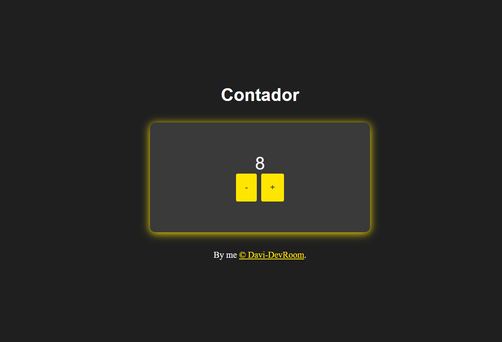
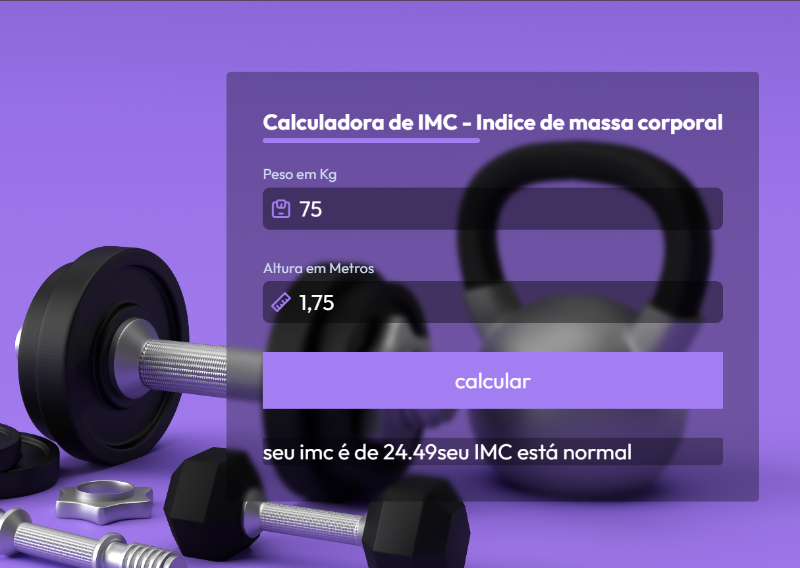
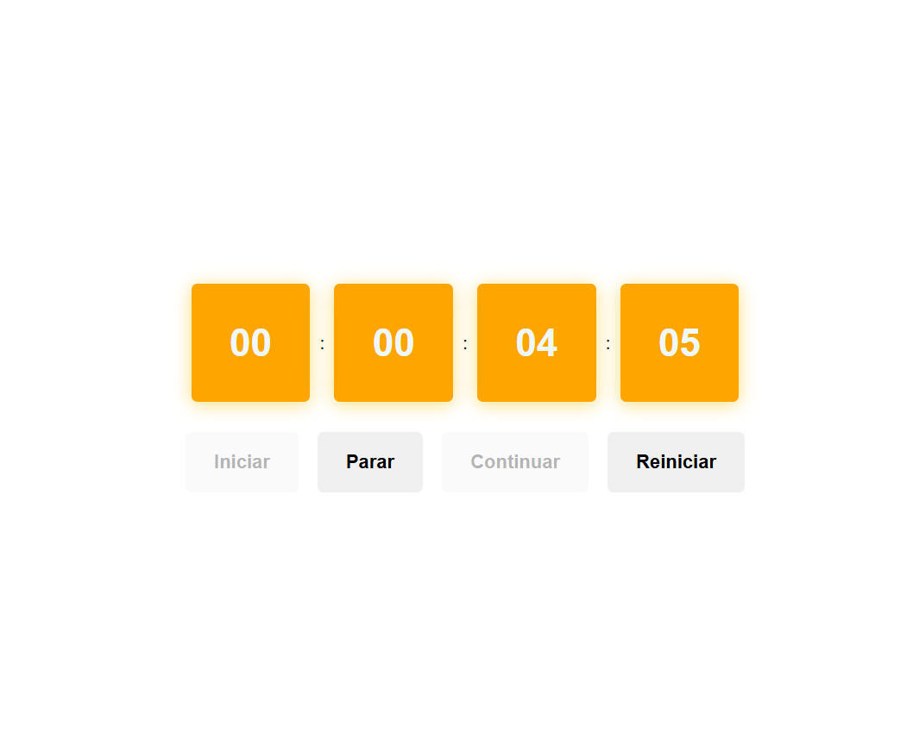

# Projetos_ES6plus

Seja bem vindo Dev, belezinha?🖖

Este projeto é um desafio que irá te ajudar a melhorar suas habilidades em programação JavaScript. Com ele você ira praticar desde o básico até o intermediário com mini projetos diários!

# Objetivo

O objetivo desse repositório é dar mini projetos para serem realizados durante o dia a dia, pois o aprendizado constante irá te ajudar no seu processo de desenvolvimento na carreira de programador.

Esse projeto conta com 30 projetos que vão desde o básico até o intermediário em JavaScript. Ele servirá como uma forma de fixar a base que você tem e ira te auxiliar a se desenvolver ainda mais no seu aprendizado continuo. 🚀

```utilize da maneira que desejar. 😉```

### *[Acessar o projeto](https://davi-devroom.github.io/Projetos_ES6plus/)*


### Projeto 1 - Trocador de cores de fundo
-----------------------------------------------------------------------


#### Explicação breve:

- Para criar o gerador de background utilizei o método Math.random para gerar uma sequencia aleatória com as informações passadas dentro da Array hex, que gera cores aleatórias e modifica o background.

##### Conteúdo revisado

* *[Array](https://developer.mozilla.org/en-US/docs/Web/JavaScript/Reference/Global_Objects/Array)*
* *[addEventListener()](https://developer.mozilla.org/en-US/docs/Web/API/EventTarget/addEventListener)*
* *[Math.random()](https://developer.mozilla.org/en-US/docs/Web/JavaScript/Reference/Global_Objects/Math/random)*
* *[Function](https://www.w3schools.com/js/js_functions.asp)*

### Projeto 2 - Botão ler mais e menos
-----------------------------------------------------------------------


#### Explicação breve:

- Para o botão funcionar, adicionei uma class hidden através de um evento que adiciona ou remove a mesma, e adicionei um verificador para visualizar se a mesma está ativa ou não com o método contains().

##### Conteúdo revisado

* *[Arrow function "() => {}"](https://developer.mozilla.org/en-US/docs/Web/JavaScript/Reference/Functions/Arrow_functions)*
* *[médoto contains()](https://developer.mozilla.org/en-US/docs/Web/API/Node/contains)*


### Projeto 3 - Contador
-----------------------------------------------------------------------



#### Explicação breve:

- Para o contador eu crio um evento de click nos botões, com um contador que irá somar ou subtrair dependendo do botão que for clicado.

##### Conteúdo revisado

* *[addEventListener()](https://developer.mozilla.org/en-US/docs/Web/API/EventTarget/addEventListener)*

### Projeto 4 - Gerador de números aleatórios
-----------------------------------------------------------------------


#### Explicação breve:

- Para o gerador funcionar, o usuário deve informar um número mínimo e um máximo. Através do método Math.random() será gerado um número aleatório levando em consideração o mínimo e o máximo passado.

##### Conteúdo revisado

* *[addEventListener()](https://developer.mozilla.org/en-US/docs/Web/API/EventTarget/addEventListener)*
* *[Math.random()](https://developer.mozilla.org/en-US/docs/Web/JavaScript/Reference/Global_Objects/Math/random)*
* *[Function](https://www.w3schools.com/js/js_functions.asp)*

### Projeto 5 - IMC
-----------------------------------------------------------------------



#### Explicação breve:

- A calculadora de IMC irá capturar os dados passados no input e, através do evento adicionado no botão calcular, ela ira realizar o cálculo e verificar em que faixa de peso o usuário se encontra.

##### Conteúdo revisado

* *[addEventListener()](https://developer.mozilla.org/en-US/docs/Web/API/EventTarget/addEventListener)*
* *[Function](https://www.w3schools.com/js/js_functions.asp)*
* *[if...else](https://developer.mozilla.org/pt-BR/docs/Web/JavaScript/Reference/Statements/if...else)*


### Projeto 6 - Cronometro
-----------------------------------------------------------------------



- Este projeto pode ser um pouco mais desafiador do que os anteriores, mas não deixe de tentar!

#### Explicação breve:

- .

##### Conteúdo revisado

* *[setInterval](https://www.w3schools.com/jsref/met_win_setinterval.asp)*
* *[clearInterval](https://www.w3schools.com/jsref/met_win_clearinterval.asp)*
* *[Function](https://www.w3schools.com/js/js_functions.asp)*
* *[Math.floor()](https://developer.mozilla.org/pt-BR/docs/Web/JavaScript/Reference/Global_Objects/Math/floor)*


### Projeto 7 - Carrossel de imagens
-----------------------------------------------------------------------


#### Explicação breve:

- Para que o slide funcione automaticamente, ele utiliza um setInterval que executa uma função periodicamente. Essa função verifica o valor do contador, identifica a posição atual do slide correspondente ao contador e atualiza o botão de navegação para destacar a imagem correspondente.

##### Conteúdo revisado

* *[setInterval](https://www.w3schools.com/jsref/met_win_setinterval.asp)*
* *[Function](https://www.w3schools.com/js/js_functions.asp)*


### Projeto 8 - Encurtador de links com api
-----------------------------------------------------------------------


#### Explicação breve:

- Para que o encurtador de links funcione, é necessário utilizar uma API Key fornecida pelo site Rebrandly. No entanto, desativei a chave por questões de segurança. Neste projeto, utilizei o método fetch, que inicia o processo de busca de um recurso na rede e retorna uma Promise que será resolvida ou rejeitada com base na resposta da solicitação.

##### Conteúdo revisado

* *[fetch()](https://developer.mozilla.org/pt-BR/docs/Web/API/Window/fetch)*
* *[then()](https://developer.mozilla.org/pt-BR/docs/Web/JavaScript/Reference/Global_Objects/Promise/then)*
* *[Function](https://www.w3schools.com/js/js_functions.asp)*

### Projeto 9 - Relógio digital
-----------------------------------------------------------------------


#### Explicação breve:

- O relógio digital funciona utilizando a função construtora new Date(), que permite obter informações detalhadas sobre a data e hora atual, como horas, minutos e segundos. Para manter o relógio atualizado em tempo real, é utilizado o método setInterval, que executa uma função periodicamente com base no intervalo especificado (em milissegundos).

Nesse caso, o setInterval é configurado para atualizar o relógio a cada segundo (1000 ms). A lógica do relógio também pode formatar os valores para garantir que sempre exibam dois dígitos (por exemplo, "09" em vez de "9"), normalmente usando métodos como .padStart() ou funções auxiliares.

##### Conteúdo revisado

* *[setInterval](https://www.w3schools.com/jsref/met_win_setinterval.asp)*
* *[constructor new Date()](https://www.w3schools.com/js/js_date_methods.asp)*

### Projeto 10 - Relógio analógico
-----------------------------------------------------------------------


#### Explicação breve:

- - O relógio analógico funciona utilizando a função construtora new Date(), que permite obter informações detalhadas sobre a data e hora atual, como horas, minutos e segundos. Assim como no projeto anterior, mas de forma diferente ao anterios, aqui o setInterval ira realizar tranformações visuais atraves do style css com o transform recebendo um translate e um rotate para.

##### Conteúdo revisado

* *[setInterval](https://www.w3schools.com/jsref/met_win_setinterval.asp)*
* *[constructor new Date()](https://www.w3schools.com/js/js_date_methods.asp)*

### Projeto 11 - Calculadora de juros simples
-----------------------------------------------------------------------


#### Explicação breve:

- Com base nos dados informados pelo usuário, a calculadora irá realizar o cálculo dos juros simples assim que o evento de clique for acionado no botão calcular, mostando o resultado na tela.

##### Conteúdo revisado

* *[Function](https://www.w3schools.com/js/js_functions.asp)*

